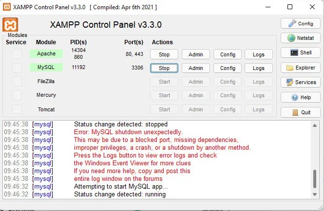

# XAMPP MySQL Fixer

Script que automatiza el procedimiento de recuperación más utilizado para el error:

> **"MySQL shutdown unexpectedly"**

Este problema suele ocurrir cuando los archivos de datos de MySQL o los archivos de InnoDB se corrompen después de un apagado inesperado, un cierre forzado de XAMPP o un fallo del sistema.

El script automatiza el proceso manual de recuperación, reduciendo errores y acelerando la restauración de las bases de datos en instalaciones de XAMPP.

> **Importante:** Esta herramienta está diseñada para los casos en que el error está relacionado con corrupción de la carpeta `data` o de archivos InnoDB. No resolverá problemas causados por conflictos de puertos, configuraciones incorrectas, permisos insuficientes u otros errores ajenos a los archivos de datos.

---

## 📷 Captura de referencia



---

## ¿Qué hace el script?

1. Renombra la carpeta `data` a `data_old`.
2. Crea una nueva carpeta `data`.
3. Copia el contenido de `backup` hacia la nueva carpeta `data`.
4. Recupera el archivo `ibdata1` desde `data_old`.
5. Copia las bases de datos del usuario excluyendo las carpetas del sistema:

   * `mysql`
   * `performance_schema`
   * `phpmyadmin`
6. Elimina automáticamente la carpeta temporal `data_old`.

---

## Instalación

### 1. Clonar el repositorio

```bash
git clone git@github.com:Davidmg5k/fixes_xampp_typical_error.git fixes_xampp_typical_error
```

### 2. Entrar al proyecto

```bash
cd fixes_xampp_typical_error
```

### 3. Instalar dependencias

```bash
uv add pyinstaller
```

---

## Ejecutar el script

```bash
python fixer.py
```

---

## Generar un ejecutable (.exe)

Para generar un único archivo ejecutable:

```bash
pyinstaller -F -c fixer.py
```

### Parámetros utilizados

| Parámetro | Descripción                             |
| --------- | --------------------------------------- |
| `-F`      | Genera un único archivo `.exe`          |
| `-c`      | Muestra la consola durante la ejecución |

El ejecutable generado se encontrará en:

```text
dist/fixer.exe
```
